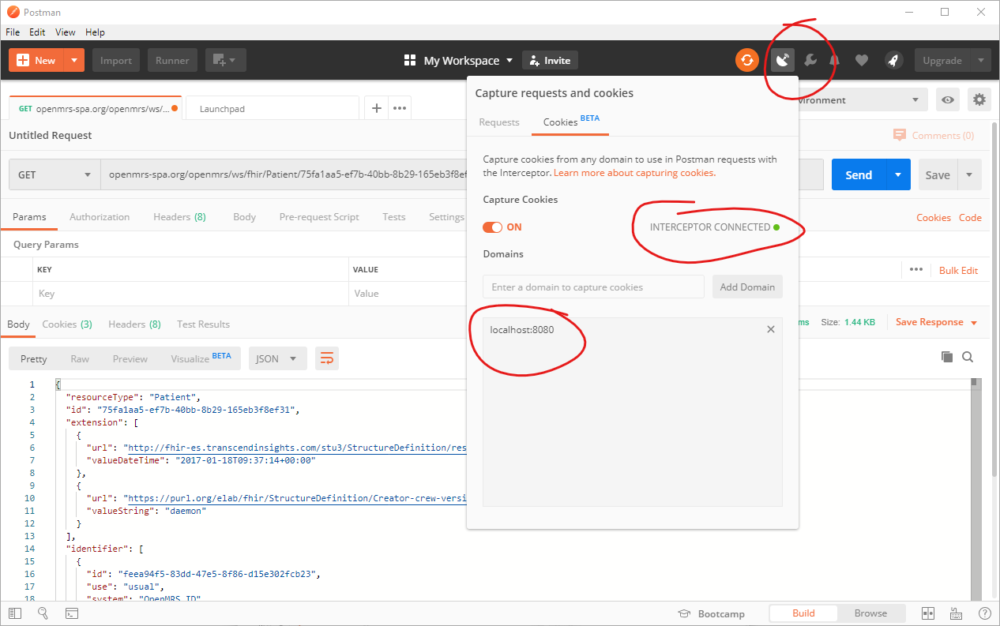

*Check out the [Webinars Github Page](https://github.com/uw-fhir/OpenMRS-FHIR-Webinars/blob/master/Webinar-3-MF-FHIR-Dev-Setup/overview-post.md/) for another view of this tutorial*

# Webinar 3 - OpenMRS Dev Setup for FHIR Module and Microfrontends

Video: (coming soon)

## Outline
- [Webinar 3 - OpenMRS Dev Setup for FHIR Module and Microfrontends](#webinar-3---openmrs-dev-setup-for-fhir-module-and-microfrontends)
  - [Outline](#outline)
  - [Overview](#overview)
  - [Learning Objectives](#learning-objectives)
  - [Referenced Resources](#referenced-resources)
  - [- https://talk.openmrs.org/t/micro-frontends-architecture-for-openmrs/22557](#httpstalkopenmrsorgtmicro-frontends-architecture-for-openmrs22557)
  - [OpenMRS Architecture Overview](#openmrs-architecture-overview)
  - [The Full Picture](#the-full-picture)
  - [Walkthrough Tutorial](#walkthrough-tutorial)
    - [1. Install Dependencies](#1-install-dependencies)
    - [2. Clone Relevant Codebases](#2-clone-relevant-codebases)
    - [3a. Install MySQL](#3a-install-mysql)
    - [3b. OR install Docker](#3b-or-install-docker)
    - [4. Set up OpenMRS RefApp](#4-set-up-openmrs-refapp)
    - [5. Build and deploy FHIR and SPA OpenMRS modules](#5-build-and-deploy-fhir-and-spa-openmrs-modules)
    - [6. Set up Microfrontends dev environment.](#6-set-up-microfrontends-dev-environment)
    - [7. Postman](#7-postman)
    - [8. Test the Setup](#8-test-the-setup)
  - [Webinar Questions](#webinar-questions)
  - [Additional Screenshots](#additional-screenshots)
  - [To-Do](#to-do)
  - [Notes](#notes)

---

## Overview
This tutorial will be focused on setting up a local development environment using the OpenMRS SDK. The approach can be generalized for work on any existing or new OpenMRS modules, but for this tutorial we will focus on the FHIR module and the Microfrontends Project. The MF project includes an OpenMRS module that allows OpenMRS to support the client-side SPA-based frontend to OpenMRS. 

Please feel free to send feedback / suggestions for improving this tutorial! This content is based on the availble documentation along with vital input from @psbrandt, and we're definitely looking to improve it with input from the community.

*Note: We won't focus on implementation-specific installation and setup that might concern you for deploying production-ready solutions. See the Implementers Guide for guidance on that.*


**End Goal**

You should be able to see the following screens after a successful setup, all running off of the local machine:


[(click here for full set of screenshots)](#screenshots)


---

## Learning Objectives

1. Gain a birds-eye view understanding of the OpenMRS reference application architecture.
2. Understand how the FHIR Module is integrated into the RefApp distribution.
3. Understand how the MF project integrates into the OpenMRS distribution.
4. Set up a development environment for working on the FHIR module using the OpenMRS SDK.
5. Set up a development environment for working on Microfrontend ES Modules.  

---

## Referenced Resources
- http://devmanual.openmrs.org/en/Technology/getSetUp.html
- https://wiki.openmrs.org/display/projects/Setup+local+development+environment+for+OpenMRS+SPA
- https://wiki.openmrs.org/pages/viewpage.action?pageId=224527568
- https://talk.openmrs.org/t/micro-frontends-architecture-for-openmrs/22557
--- 

## OpenMRS Architecture Overview
http://devmanual.openmrs.org/en/Technology/architecture.html


OpenMRS is designed using a [Modular Architecture](http://devmanual.openmrs.org/en/Technology/architecture.html#the-modular-architecture) that allows for flexible customizations of functionality to fit the specific needs of the different [places that OpenMRS is used](http://devmanual.openmrs.org/en/Kick_off/openmrs_today.html). 

Today, we will be mostly working with the [OpenMRS Reference Application](https://github.com/openmrs/openmrs-distro-referenceapplication), which consists of the OpenMRS core application and a set of default modules that provide generic functionality. A list of the modules included in the Ref App can be found here: https://github.com/openmrs/openmrs-distro-referenceapplication/blob/master/package/src/main/resources/openmrs-distro.properties. To test out the functionality of the Ref App, you can take a look at the [OpenMRS Demo](https://openmrs.org/demo/). 

**The OpenMRS FHIR Module**
One of the modules that comes bundled with the reference application is the [OpenMRS FHIR Module](https://github.com/openmrs/openmrs-module-fhir). We will examine how to develop and deploy new features in this module. You can read more about the OpenMRS FHIR Module project on this [OpenMRS Wiki Page](https://wiki.openmrs.org/display/projects/OpenMRS+FHIR+Module). 

If you're interested in getting further involved in this project, join the [OpenMRS FHIR Squad] and check out the `#fhir` channel on the [OpenMRS Slack](https://slack.openmrs.org/).

[tech review](https://github.com/uw-fhir/OpenMRS-FHIR-Webinars/blob/master/Webinar-3-MF-FHIR-Dev-Setup/tech-review.md)

**SPA Module**
The second project we will focus on is the [Microfrontends Project](https://wiki.openmrs.org/display/projects/Frontend+-+SPA+and+Microfrontends). This excellent [OpenMRS Talk post](https://talk.openmrs.org/t/an-amazing-future-for-openmrs/22328) - and [this followup](https://talk.openmrs.org/t/micro-frontends-architecture-for-openmrs/22557) - give a great overview of the motivations behind the Microfrontends approach. The project is under current development by the [OpenMRS Microfrontend Squad](https:// wiki.openmrs.org/display/projects/Frontend+-+SPA+and+Microfrontends). 

The [OpenMRS SPA module](https://github.com/openmrs/openmrs-module-spa) is not included with the Reference Application distribution, and we will have to deploy it to our OpenMRS instance using the [OpenMRS SDK](https://wiki.openmrs.org/display/docs/OpenMRS+SDK). 

If you're interested in more information, you can join the `#microfrontend` channel on the [OpenMRS Slack](https://slack.openmrs.org/) and follow the development process on [Github](https://github.com/openmrs/openmrs-rfc-frontend) or on [OpenMRS Talk](https://talk.openmrs.org/t/micro-frontends-architecture-for-openmrs/22557/51).

**The Import Map and Frontend Javascript Modules (ESM)**
https://wiki.openmrs.org/display/projects/Frontend+Implementer+Documentation

## The Full Picture

**At the end of this tutorial, your local development enviroment should look as follows:**

- An OpenMRS server running the latest OpenMRS Referance Application distribution.
- A cloned [OpenMRS FHIR module](https://github.com/openmrs/openmrs-module-fhir) codebase that is compiled locally and used by the OpenMRS server.
- A cloned [OpenMRS SPA module](https://github.com/openmrs/openmrs-module-spa) codebase that is compiled locally and used by the OpenMRS server.
- Cloned codebases for the FHIR and Home Microfrontend javascript modules that compile and are served up locally, and connect to the OpenMRS server using the mentioned SPA module. 

## Walkthrough Tutorial

**Related Resources**
- http://devmanual.openmrs.org/en/Technology/getSetUp.html
- https://wiki.openmrs.org/display/projects/Setup+local+development+environment+for+OpenMRS+SPA

### 1. Install Dependencies

**Java**

Install JDK 8:
https://docs.oracle.com/javase/8/docs/technotes/guides/install/install_overview.html

```
> java -version

java version "1.8.0_221"
Java(TM) SE Runtime Environment (build 1.8.0_221-b11)
Java HotSpot(TM) 64-Bit Server VM (build 25.221-b11, mixed mode)
```

**Maven**

Install Maven:
http://maven.apache.org/guides/getting-started/maven-in-five-minutes.html

```
mvn --version

Apache Maven 3.6.2 (40f52333136460af0dc0d7232c0dc0bcf0d9e117; 2019-08-27T08:06:16-07:00)
Maven home: C:\lib\apache-maven-3.6.2\bin\..
Java version: 1.8.0_221, vendor: Oracle Corporation, runtime: C:\java\jdk1.8.0_221\jre
Default locale: en_US, platform encoding: Cp1252
OS name: "windows 10", version: "10.0", arch: "amd64", family: "windows"
```

**OpenMRS SDK**

http://devmanual.openmrs.org/en/Technology/getSetUp.html#download-and-install
https://wiki.openmrs.org/display/docs/OpenMRS+SDK#OpenMRSSDK-Setup
https://wiki.openmrs.org/display/docs/OpenMRS+SDK+Step+By+Step+Tutorials


```
> mvn org.openmrs.maven.plugins:openmrs-sdk-maven-plugin:setup-sdk
> mvn openmrs-sdk:help

[INFO] Scanning for projects...
.
.
.
OpenMRS SDK 3.13.2

For more info, see SDK documentation: https://wiki.openmrs.org/display/docs/OpenMRS+SDK
```

### 2. Clone Relevant Codebases

**OpenMRS FHIR Module**
`git clone https://github.com/openmrs/openmrs-module-fhir.git`

**OpenMRS SPA Module**
`git clone https://github.com/openmrs/openmrs-module-spa.git`

**Javascript Modules**

In this example, we will clone the `openmrs-esm-home` and the `openmrs-esm-api` codebases, but feel free to choose whichever `openmrs-esm-*` projects you'd like.

```
git clone https://github.com/openmrs/openmrs-esm-api.git
git clone https://github.com/openmrs/openmrs-esm-login.git
```

### 3a. Install MySQL
https://dev.mysql.com/doc/refman/8.0/en/general-installation-issues.html


```
> bin\mysqladmin -u root -p version

Enter password: *****
bin\mysqladmin  Ver 8.42 Distrib 5.7.27, for Win64 on x86_64
Copyright (c) 2000, 2019, Oracle and/or its affiliates. All rights reserved.
.
.
.

```

### 3b. OR install Docker
https://docs.docker.com/install/

```
> docker -v

Docker version 19.03.4, build 9013bf5
```

### 4. Set up OpenMRS RefApp
https://wiki.openmrs.org/display/docs/OpenMRS+SDK#OpenMRSSDK-Setup

We will use the *OpenMRS SDK* to create a local development server running the OpenMRS Reference Application Distribution.

```
> mvn openmrs-sdk:setup -DserverId=openmrs-dev -Ddistro=referenceapplication:2.9.0 -DdbUri=jdbc:mysql://localhost:3306/openmrs -DdbUser=openmrs -DdbPassword=openmrs
...

What port would you like your server to use? (default: '8080'):
> 8080

If you want to enable remote debugging by default when running the server,
specify the port number here (e.g. 1044). Leave blank to disable debugging.
(Do not do this on a production server) (default: 'no debugging'):

> 1044

Which database would you like to use?:
1) MySQL 5.6 (requires pre-installed MySQL 5.6)
2) MySQL 5.6 in SDK docker container (requires pre-installed Docker)
3) Existing docker container (requires pre-installed Docker)

Which one do you choose? [1/2/3]: 
> <1 OR 2>

...

Note: JDK 1.8 is needed for platform version 2.1.4.

Which JDK would you like to use to run this server?:
1) JAVA_HOME (currently: C:\java\jdk1.8.0_221\jre)
2) Other...

>> 1

[INFO] Server configured successfully
[INFO] ------------------------------------------------------------------------
[INFO] BUILD SUCCESS
[INFO] ------------------------------------------------------------------------
[INFO] Total time:  02:48 min
[INFO] Finished at: 2019-10-21T15:22:18-07:00
[INFO] ------------------------------------------------------------------------
```

**Demo Patients**
https://wiki.openmrs.org/display/RES/Demo+Data

> For the OpenMRS Reference Application, just set the setting named 
> `referencedemodata.createDemoPatientsOnNextStartup` to the number of demo
> patients you want created and restart the application. 
> 
> The setting `referencedemodata.createDemoPatientsOnNextStartup` is accessible 
> through the new UI via `Home > System Administration > Manage Global Properties`. 
> 
> It is also accessible through the old admin UI in `Maintenance > Advanced Settings`.


**Test the Ref App:**
> mvn openmrs-sdk:run -DserverId=openmrs-dev

```
[INFO] Scanning for projects...
[INFO]
[INFO] ------------------< org.apache.maven:standalone-pom >-------------------
[INFO] Building Maven Stub Project (No POM) 1
[INFO] --------------------------------[ pom ]---------------------------------
[INFO]
[INFO] --- openmrs-sdk-maven-plugin:3.13.2:run (default-cli) @ standalone-pom ---

Checking if port 8080 is in use... [free]

Connect remote debugger with port 1044

Forking a new process... (use -Dfork=false to prevent forking)

Listening for transport dt_socket at address: 1044
.
.
.
INFO: Starting ProtocolHandler ["http-bio-8080"]
```

Open a browser and go to http://localhost:8080/openmrs/. 

You should see the following page:


Let the setup process complete in peace :smile: It might take quite some time :sleepy: 

:hourglass:  
:hourglass:  
:hourglass:


Enter the very secure `admin\Admin123` username and password combo, choose a location to "login" from, and you should see the following screen at http://localhost:8080/openmrs/referenceapplication/home.page:


### 5. Build and deploy FHIR and SPA OpenMRS modules
https://wiki.openmrs.org/display/docs/OpenMRS+SDK#OpenMRSSDK-Deployingprojects

Go to `System Administration > Advanced Administration > Manage Modules`. 

You should see the following list of modules - note the FHIR module version, and the absense of the OpenMRS SPA module. 


We'll deploy local versions of our modules using the cloned codebases from earlier.

```
> cd <path-to-cloned>/openmrs-module-fhir

mvn openmrs-sdk:deploy -DserverId=openmrs-dev

Would you like to deploy fhir 1.20.0-SNAPSHOT from the current directory? [Y/n]: 

> Y

Do you want to update module 'fhir' in version '1.18.0' to version '1.20.0-SNAPSHOT'? [Y/n]:

> Y
.
.
.
[INFO] ------------------------------------------------------------------------
[INFO] BUILD SUCCESS
[INFO] ------------------------------------------------------------------------
[INFO] Total time:  35.814 s
[INFO] Finished at: 2019-10-28T11:52:22-07:00
[INFO] ------------------------------------------------------------------------
```

```
> cd <path-to-cloned>/openmrs-module-spa

mvn openmrs-sdk:deploy -DserverId=openmrs-dev

.
.
.

[INFO] ------------------------------------------------------------------------
[INFO] BUILD SUCCESS
[INFO] ------------------------------------------------------------------------
[INFO] Total time:  5.785 s
[INFO] Finished at: 2019-10-28T11:54:31-07:00
[INFO] ------------------------------------------------------------------------
```

Now, restart the server: `mvn openmrs-sdk:run -DserverId=openmrs-dev`

Your modules page should look like this:
 

### 6. Set up Microfrontends dev environment.

**Related Resources**
- https://wiki.openmrs.org/display/projects/Frontend+Implementer+Documentation
- https://wiki.openmrs.org/display/projects/Setup+local+development+environment+for+OpenMRS+SPA
- https://wiki.openmrs.org/pages/viewpage.action?pageId=224527568
  - https://wiki.openmrs.org/display/projects/openmrs-esm-login
  - https://wiki.openmrs.org/display/projects/openmrs-esm-api
- https://wiki.openmrs.org/display/projects/openmrs-esm-devtools
- https://github.com/joeldenning/import-map-overrides
  
**Prerequesites:**
- Git
- Node and NPM 
  **Note: `npm run build` in the [Packmap instructions](https://github.com/openmrs/packmap/blob/master/examples/openmrs-example/README.md) caused an error in NPM 8.9, but worked as documented in npm 10. Look into this requirement and document it.**

The MF UI requires a couple of different assets to be served ([as specified here]( https://github.com/openmrs/openmrs-module-spa/blob/fdd8bf2719a1c21351ed9497b2e1526c4b7ab61d/omod/src/main/webapp/master-single-page-application.jsp#L14)):
- The [import map](https://github.com/WICG/import-maps): https://github.com/openmrs/packmap
- SystemJS: https://github.com/systemjs/systemjs

We need to package the MF ESM packages for local development, as described [here](https://github.com/openmrs/packmap/blob/master/examples/openmrs-example/README.md)

```
> git clone https://github.com/openmrs/packmap.git
> cd packmap/examples/openmrs-example
> npm install
> npm run build
```

The `packmap/examples/openmrs-example/openmrs/frontend` will include the files that need to go in the `frontend` folder for the OpenMRS server, so we copy the contents over:
`cp <path-to-packmap-directory>/examples/openmrs-example/openmrs/frontend <path-to-openmrs-server-root>/frontend`

Now, we should be able to access the Microfrontends UI at this address: https://localhost:8080/openmrs/spa

However, we need to make sure that we set an exception for local SSL connections using the following guide for [trusting insecure localhost SSL certificates](https://improveandrepeat.com/2016/09/allowing-self-signed-certificates-on-localhost-with-chrome-and-firefox/).

### 7. Postman
https://learning.getpostman.com/docs/postman/sending-api-requests/interceptor-extension/
https://blog.getpostman.com/2019/06/24/introducing-interceptor-integration-for-native-postman-apps/

In order to more easily send and analyse API requests to the local OpenMRS server, we can use *Postman*. In order for the requests to get through the authentication, we can set up the capture of Chrome cookies using the *Postman* interceptor. As a result, requests sent from the native *Postman* app will use the same session cookies as the Chrome browser, allowing us to log in using the browser, capture the generated cookies using the *Interceptor*, and then switch to sending requests using *Postman*.

1. Download and install *Postman* from https://www.getpostman.com/

2. Download and install the *Postman Interceptor Bridge* for your OS from here: https://learning.getpostman.com/docs/postman/sending-api-requests/interceptor-extension/#installing-the-interceptor-bridge

3. Install the *Postman Interceptor* Chrome Extension from here: https://go.pstmn.io/interceptor-download

4. Start *Postman* and click the `satellite` button in the top corner. Click on the `Cookies` tab, and you should see a message that says `Interceptor Connected` and a green dot. 

5. Turn on Cookie caputre and put in your local dev address/port in the `Domains` section. Your screen should look like this: 



### 8. Test the Setup

**OpenMRS Reference Application**
To test out our OpenMRS Ref App, we will create a patient using the UI. We will then use the built-in FHIR Client to send a `GET` request to our OpenMRS FHIR Server, and try to retrieve the created patient as a FHIR resource.

*Prereq: Make sure Postman is running and capturing your browser cookies like explained [here](postman-cookies-setup.png)*

1. `mvn openmrs-sdk:run -DserverId=openmrs-dev`
   
2. Open your browser and go to `localhost:8080/openmrs` and login as `admin\Admin123`

3. Create a patient - be creative!
   
4. Note the UUID of the patient in the url
      
5. Check whether the FHIR module is installed correctly. You should be able to access the following resources: 
      - http://localhost:8080/openmrs/module/fhir/rest/swagger.json
      - http://localhost:8080/openmrs/module/fhir/apidocs.form#/default

6. Go to `>Admin>AdvancedAdmin>FHIR Module`

7. OpenMRS the FHIR Client and replace the patient id w/ your patient's uuid

8. send the request and make sure you get the correct json FHIR resource representing your patient

9. Copy the request url and create a Postman request using it. Make sure you're caputring the cookies!
    


**OpenMRS Microfrontend UI**
To test out the Microfrontends setup, we'll use the config module to change the logo of the OpenMRS MF login screen. 

## Webinar Questions
*This is a list of questions that came up during the webinar, along with eventual answers/clarifications*

(nothing here yet!)

## Additional Screenshots


## To-Do
- [ ] Post to Github and OpenMRS Talk
- [ ] Schedule time for an OpenMRS webinar on this topic


## Notes

https://wiki.hl7.org/index.php?title=Using_the_FHIR_Validator

Sample Data?
''
