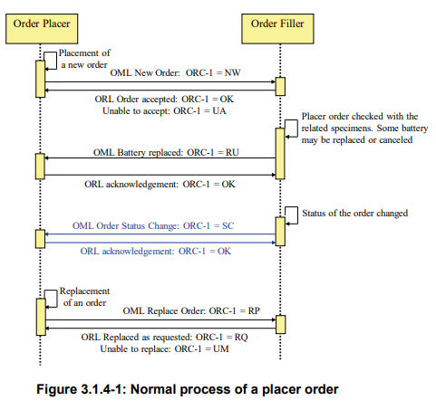
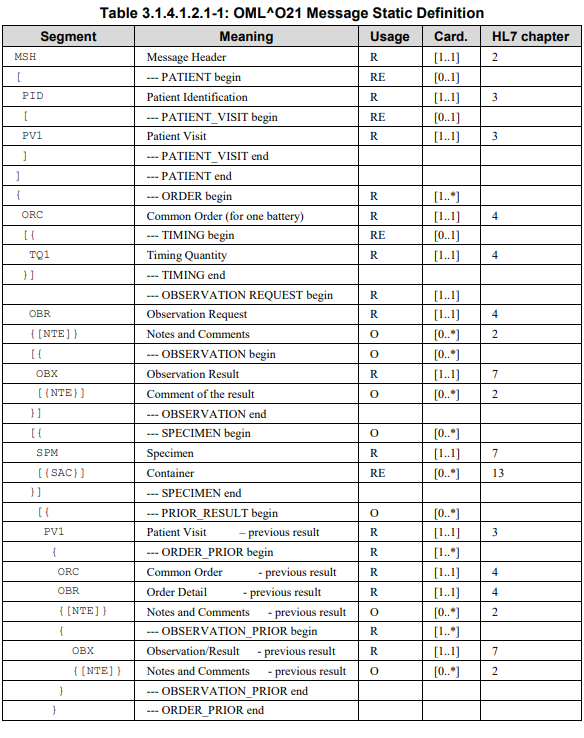

# Technical Review of the OpenMRS FHIR Module

https://github.com/openmrs/openmrs-module-fhir

- [Technical Review of the OpenMRS FHIR Module](#technical-review-of-the-openmrs-fhir-module)
  - [OpenMRS Architecture](#openmrs-architecture)
    - [OpenMRS and OpenMRS Modules](#openmrs-and-openmrs-modules)
  - [The FHIR Module](#the-fhir-module)
    - [Constants](#constants)
    - [FHIR REST Server Initialization](#fhir-rest-server-initialization)
    - [Architecture](#architecture)
  - [Case Studies](#case-studies)
    - [1. The Basics - A GET request for a specific patient using the patient ID**](#1-the-basics---a-get-request-for-a-specific-patient-using-the-patient-id)
    - [2. iSantéPlus (Haiti) - OpenELIS Interoperability](#2-isant%c3%a9plus-haiti---openelis-interoperability)
  - [Notes](#notes)
    - [Swagger Documentation Generation](#swagger-documentation-generation)
    - [Validation](#validation)
    - [Profiles / Resource support](#profiles--resource-support)

## OpenMRS Architecture

### OpenMRS and OpenMRS Modules
http://devmanual.openmrs.org/en/Technology/architecture.html 

http://devmanual.openmrs.org/en/Technology/architecture.html#the-modular-architecture


**OpenMRS Data Model**


**Hibernate**
- Object-Relational Mapping
  
**Spring**
Application development framework
- supports MVC model 
- Aspect-oriented programming
  
**Presentation**

*Reference Application UI* 
https://github.com/openmrs/openmrs-distro-referenceapplication

*Microfrontends UI*
https://github.com/openmrs/openmrs-rfc-frontend/tree/master/text

---

## The FHIR Module
https://wiki.openmrs.org/display/projects/OpenMRS+FHIR+Module
https://wiki.openmrs.org/display/projects/OpenMRS+FHIR+Module+Architecture
http://localhost:8080/openmrs/module/fhir/apidocs.form#/default


*Note: access these resources after logging in as `admin\Admin123`*

- Conformance Statement: https://openmrs-spa.org/openmrs/ws/fhir/metadata
- Swagger Json: https://openmrs-spa.org/openmrs/module/fhir/rest/swagger.json
- Swagger Docs: https://openmrs-spa.org/openmrs/module/fhir/apidocs.form#/default

### Constants

https://github.com/openmrs/openmrs-module-fhir/blob/abfd7dd0f489fe0b59978b26d70f40e2c71415cb/api/src/main/java/org/openmrs/module/fhir/api/util/FHIRConstants.java

https://github.com/openmrs/openmrs-module-fhir/blob/master/omod/src/main/java/org/openmrs/module/fhir/util/FHIROmodConstants.java

### FHIR REST Server Initialization
https://github.com/openmrs/openmrs-module-fhir/blob/b983f7faab7a4ccfd5724a59888029abb36d3347/omod/src/main/java/org/openmrs/module/fhir/server/FHIRRESTServer.java#L46

### Architecture
**Overview and Strategy Pattern**
https://wiki.openmrs.org/display/projects/FHIR+Strategy+Pattern
https://wiki.openmrs.org/display/projects/OpenMRS+FHIR+Module+Development%3A+Phase+01


**Rollout Plan**


**Current situation vs. Potential Outcome**


**Smart on FHIR Model**


## Case Studies

--- 

### 1. The Basics - A GET request for a specific patient using the patient ID**

1. https://github.com/openmrs/openmrs-module-fhir/tree/master/api/src/main/java/org/openmrs/module/fhir/api

2. https://github.com/openmrs/openmrs-module-fhir/blob/master/api/src/main/java/org/openmrs/module/fhir/api/util/FHIRPatientUtil.java

3. Compare https://hapifhir.io/apidocs-dstu3/org/hl7/fhir/dstu3/model/Patient.html and http://hl7.org/fhir/STU3/patient.html

4. https://github.com/openmrs/openmrs-module-fhir/blob/master/api/src/main/java/org/openmrs/module/fhir/api/strategies/patient/PatientStrategy.java

--- 

### 2. iSantéPlus (Haiti) - OpenELIS Interoperability

**Workflow 1 - New Lab Order**

In this workflow, a lab order is created in iSantéPlus and sent to OpenELIS. 

Currently, the workflow is implemented using the HL7 V2 messages ([as defined starting on page 13 in this IHE PDF](http://www.ihe.net/uploadedFiles/Documents/PaLM/IHE_PaLM_TF_Vol2a.pdf)). The current solution uses the following messages:

- OML^O21^OML_O21: laboratory order message. 
- ORL^O22^ORL_O22: Acknowledgement for OML^O21^OML_O21





The HL7V2 message is packaged in a XDS document, and OpenELIS is notified that the message is ready for reading. OpenELIS then reads the message, validates it, and sends back an awknowledgment to iSantéPlus. If any errors occur, they are properly handled. 

Objective: Implement this specific workflow using the FHIR module and FHIR Observation / other resources instead of HL7 V2 and [OpenXDS](http://www.openempi.org/confluence/display/openxds/Home).  

**How does the FHIR Module handle a `GET` request for an `Observation` resource?**

*Conformance Statement for the Observation Resource*  
(see [here](#profiles--resource-support) for related notes)

*Swagger Doc for the Observation Resource*   
(see [here](#swagger-documentation-generation) for related notes)

*FHIR Server Definition*

---

**Code Run-Through: Use the FHIR Client to query the FHIR Server for an Observation resource**
   * How is the request routed? Where are routes defined?
  
   * What controller handles the request?

   * Where is the OpenMRS data model queried to retrieve requested object?

   * Where is this OpenMRS object used to create a FHIR Resource object?

   * Where is this FHIR Resource Validated? What rules / profiles is it being validated against? Is this level of validation sufficient for our usecase?
  
**Implementation Details and Gaps:**

Are the data attributes required in the workflow supported by the current implementation of the Observation resource?

Is there a mechanism for correctly validating the FHIR resource / resources sent as part of this transaction?

Has the OpenELIS team considered this workflow in their work on their FHIR Module?

---

## Notes

### Swagger Documentation Generation

https://wiki.openmrs.org/display/projects/FHIR+Swagger+Documentation
* https://wiki.openmrs.org/display/projects/FHIR+Swagger+Document+generator+and+enhancements
* https://wiki.openmrs.org/display/projects/FHIR+Swagger+Codegen+Integration+and+Strategic+Improvements

What is this generator using exactly to build the Swagger API?

Is it auto-generated or based on the conformance statement? 
similar approach: 
https://github.com/rbren/fhir-swagger


Answer: generated from conformance, using [this library](https://github.com/openmrs/openmrs-module-fhir/blob/b983f7faab7a4ccfd5724a59888029abb36d3347/omod/src/main/java/org/openmrs/module/fhir/swagger/SwaggerSpecificationCreator.java#L21)
and this [method](https://github.com/openmrs/openmrs-module-fhir/blob/b983f7faab7a4ccfd5724a59888029abb36d3347/omod/src/main/java/org/openmrs/module/fhir/swagger/SwaggerSpecificationCreator.java#L137)

Related commits:  
- https://github.com/openmrs/openmrs-module-fhir/commit/6e4ff55fc312ee9d2694a26f4a9cfeb464b4d7d5
- https://github.com/openmrs/openmrs-module-fhir/commit/74483ded981bb13babd90131e08b76d1b5d2e8be)

https://swagger.io/docs/open-source-tools/swagger-codegen/

https://github.com/openmrs/openmrs-module-webservices.rest/blob/master/omod-common/src/main/java/org/openmrs/module/webservices/docs/swagger/SwaggerSpecificationCreator.java

https://wiki.openmrs.org/display/projects/Support+Laboratory+Data+Exchange+with+FHIR

---

### Validation
- https://hapifhir.io/doc_validation.html
- https://github.com/openmrs/openmrs-module-fhir/blob/abfd7dd0f489fe0b59978b26d70f40e2c71415cb/api/src/main/java/org/openmrs/module/fhir/api/util/FHIRUtils.java#L54
- https://github.com/openmrs/openmrs-module-fhir/search?q=validate&unscoped_q=validate
- https://wiki.hl7.org/index.php?title=Using_the_FHIR_Validator

- https://github.com/openmrs/openmrs-module-fhir/blob/abfd7dd0f489fe0b59978b26d70f40e2c71415cb/api/src/main/java/org/openmrs/module/fhir/api/validator/SpecificObsValidator.java


```
import ca.uhn.fhir.context.FhirContext;
import ca.uhn.fhir.validation.FhirValidator;
import ca.uhn.fhir.validation.ValidationResult;

import org.openmrs.api.context.Context;
import org.openmrs.module.fhir.api.manager.FHIRContextFactory;


private static FhirContext ctx = FHIRContextFactory.getFHIRContext();

private static FhirValidator val = ctx.newValidator();
```

---

### Profiles / Resource support
https://hapifhir.io/doc_extensions.html#_toc_custom_resource_types

Does not seem like the FHIR module extends any resources or defines any profiles, at least how the link above suggests it to be done. 

    * Note the "profile" attribute below, which indicates the URL/ID of the
    * profile implemented by this resource. You are not required to supply this,
    * but if you do it will be automatically populated in the resource meta
    * tag if the resource is returned by a server.

Here's a FHIR patient resource def: https://github.com/openmrs/openmrs-module-fhir/blob/master/omod/src/main/java/org/openmrs/module/fhir/resources/FHIRPatientResource.java