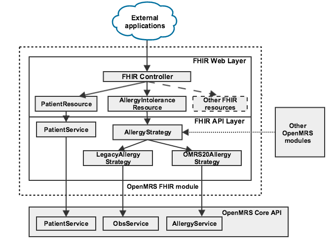
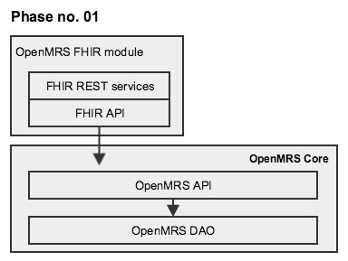
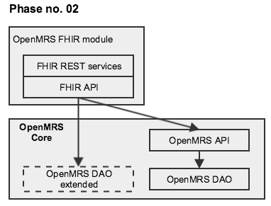
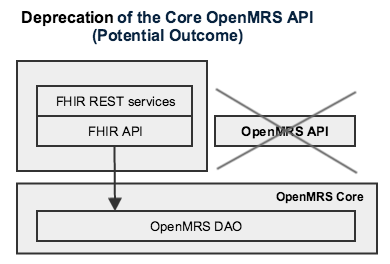
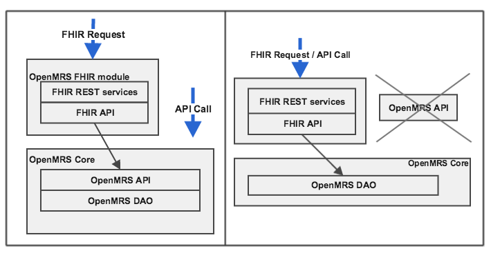
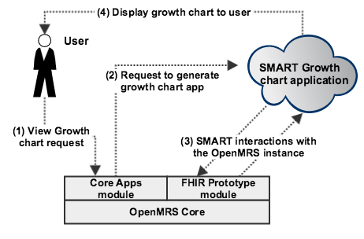

# Technical Review of the OpenMRS FHIR Module

https://github.com/openmrs/openmrs-module-fhir

- [Technical Review of the OpenMRS FHIR Module](#technical-review-of-the-openmrs-fhir-module)
  - [Architecture](#architecture)
    - [OpenMRS and OpenMRS Modules](#openmrs-and-openmrs-modules)
    - [The FHIR Module](#the-fhir-module)
      - [FHIR Constants](#fhir-constants)
      - [REST Server Initialization](#rest-server-initialization)
      - [Architecture Diagrams](#architecture-diagrams)
      - [Code Study: Serving a Patient Resource](#code-study-serving-a-patient-resource)
      - [Profiles / Resource support](#profiles--resource-support)
      - [Validation](#validation)
      - [Documentation](#documentation)

## Architecture

### OpenMRS and OpenMRS Modules
http://devmanual.openmrs.org/en/Technology/architecture.html 

http://devmanual.openmrs.org/en/Technology/architecture.html#the-modular-architecture


**OpenMRS Data Model**


**Hibernate**
- Object-Relational Mapping
  
**Spring**
Application development framework
- support MVC model 
- Aspect-oriented programming
  
**Presentation**

*Reference Application UI* 
https://github.com/openmrs/openmrs-distro-referenceapplication

*Microfrontends UI*
https://github.com/openmrs/openmrs-rfc-frontend/tree/master/text

---

### The FHIR Module
https://wiki.openmrs.org/display/projects/OpenMRS+FHIR+Module
https://wiki.openmrs.org/display/projects/OpenMRS+FHIR+Module+Architecture

Conformance Statement: https://openmrs-spa.org/openmrs/ws/fhir/metadata

#### FHIR Constants
https://github.com/openmrs/openmrs-module-fhir/blob/abfd7dd0f489fe0b59978b26d70f40e2c71415cb/api/src/main/java/org/openmrs/module/fhir/api/util/FHIRConstants.java

#### REST Server Initialization
https://github.com/openmrs/openmrs-module-fhir/blob/b983f7faab7a4ccfd5724a59888029abb36d3347/omod/src/main/java/org/openmrs/module/fhir/server/FHIRRESTServer.java#L46

#### Architecture Diagrams

**Overview and Strategy Pattern**
https://wiki.openmrs.org/display/projects/FHIR+Strategy+Pattern
https://wiki.openmrs.org/display/projects/OpenMRS+FHIR+Module+Development%3A+Phase+01



**Rollout Plan**





**Current situation vs. Potential Outcome**



**Smart on FHIR Model**



#### Code Study: Serving a Patient Resource

1. https://github.com/openmrs/openmrs-module-fhir/tree/master/api/src/main/java/org/openmrs/module/fhir/api

2. https://github.com/openmrs/openmrs-module-fhir/blob/master/api/src/main/java/org/openmrs/module/fhir/api/util/FHIRPatientUtil.java

3. Compare https://hapifhir.io/apidocs-dstu3/org/hl7/fhir/dstu3/model/Patient.html and http://hl7.org/fhir/STU3/patient.html

4. https://github.com/openmrs/openmrs-module-fhir/blob/master/api/src/main/java/org/openmrs/module/fhir/api/strategies/patient/PatientStrategy.java

#### Profiles / Resource support
https://hapifhir.io/doc_extensions.html#_toc_custom_resource_types

Does not seem like the FHIR module extends any resources or defines any profiles, at least how the link above suggests it to be done. 

    * Note the "profile" attribute below, which indicates the URL/ID of the
    * profile implemented by this resource. You are not required to supply this,
    * but if you do it will be automatically populated in the resource meta
    * tag if the resource is returned by a server.

Here's a FHIR patient resource def: https://github.com/openmrs/openmrs-module-fhir/blob/master/omod/src/main/java/org/openmrs/module/fhir/resources/FHIRPatientResource.java


#### Validation 
https://github.com/openmrs/openmrs-module-fhir/blob/abfd7dd0f489fe0b59978b26d70f40e2c71415cb/api/src/main/java/org/openmrs/module/fhir/api/util/FHIRUtils.java#L54

https://hapifhir.io/doc_validation.html
```
import ca.uhn.fhir.context.FhirContext;
import ca.uhn.fhir.validation.FhirValidator;
import ca.uhn.fhir.validation.ValidationResult;

import org.openmrs.api.context.Context;
import org.openmrs.module.fhir.api.manager.FHIRContextFactory;


private static FhirContext ctx = FHIRContextFactory.getFHIRContext();

private static FhirValidator val = ctx.newValidator();


```

- https://github.com/openmrs/openmrs-module-fhir/search?q=validate&unscoped_q=validate
- https://wiki.hl7.org/index.php?title=Using_the_FHIR_Validator
- 

- https://github.com/openmrs/openmrs-module-fhir/blob/abfd7dd0f489fe0b59978b26d70f40e2c71415cb/api/src/main/java/org/openmrs/module/fhir/api/validator/SpecificObsValidator.java


#### Documentation

**Swagger Documentation Generation** 

https://wiki.openmrs.org/display/projects/FHIR+Swagger+Documentation
* https://wiki.openmrs.org/display/projects/FHIR+Swagger+Document+generator+and+enhancements
* https://wiki.openmrs.org/display/projects/FHIR+Swagger+Codegen+Integration+and+Strategic+Improvements

What is this generator using exactly to build the Swagger API?

Is it auto-generated or based on the conformance statement? 
similar approach: 
https://github.com/rbren/fhir-swagger


Answer: generated from conformance, using [this library](https://github.com/openmrs/openmrs-module-fhir/blob/b983f7faab7a4ccfd5724a59888029abb36d3347/omod/src/main/java/org/openmrs/module/fhir/swagger/SwaggerSpecificationCreator.java#L21)
and this [method](https://github.com/openmrs/openmrs-module-fhir/blob/b983f7faab7a4ccfd5724a59888029abb36d3347/omod/src/main/java/org/openmrs/module/fhir/swagger/SwaggerSpecificationCreator.java#L137)

Related commits:  
- https://github.com/openmrs/openmrs-module-fhir/commit/6e4ff55fc312ee9d2694a26f4a9cfeb464b4d7d5
- https://github.com/openmrs/openmrs-module-fhir/commit/74483ded981bb13babd90131e08b76d1b5d2e8be)

https://swagger.io/docs/open-source-tools/swagger-codegen/
https://github.com/openmrs/openmrs-module-webservices.rest/blob/master/omod-common/src/main/java/org/openmrs/module/webservices/docs/swagger/SwaggerSpecificationCreator.java
